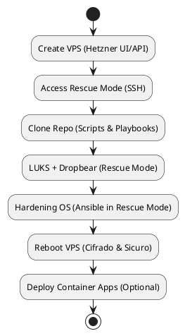

# 🔹 Guida completa: Uso della repo dalla Rescue Mode Hetzner

## **Obiettivo**

Questa guida descrive come usare il progetto **interamente dalla rescue mode della VPS Hetzner**, senza installare nulla sul PC locale, sfruttando **tutti gli script e playbook già presenti nella repo**.

* Sistema operativo finale: Debian (o Ubuntu se non si modificano i template).
* Disco cifrato con LUKS.
* Initramfs con Dropbear per sblocco remoto.
* Hardening OS completo tramite Ansible.
* Applicazioni containerizzate (Vault, FastAPI) opzionali.

---

## **Prerequisiti**

* Account Hetzner Cloud con accesso al VPS.
* SSH verso la VPS in **rescue mode**.
* Conoscenze base di Linux e SSH.
* Nessun software da installare sul PC locale.

> Tutto il workflow può essere eseguito dalla rescue mode, inclusi eventuali container CLI (Terraform, Ansible, Vault).

---

## **Fase 1: Creazione della VPS**

1. Accedi al [Hetzner Cloud Console](https://console.hetzner.cloud/) o usa API.
2. Crea una nuova VPS:

   * OS: Debian (modificabile dai template della repo se si vuole Debian al posto di Ubuntu)
   * Dimensione: a scelta
   * Prendi nota dell’IP pubblico

> Questa fase richiede solo Hetzner, nulla sul PC locale.

---

## **Fase 2: Avvio della Rescue Mode**

1. Abilita **Rescue Mode** dalla console Hetzner.
2. Hetzner fornirà credenziali temporanee (`root`) e IP.
3. Connettiti via SSH alla VPS in rescue mode:

```bash
ssh root@<IP_VPS>
```

> Ora sei in un ambiente temporaneo che gira in RAM e può operare sul disco root della VPS.

---

## **Fase 3: Preparazione dell’ambiente e clonazione della repo**

1. Aggiorna pacchetti del rescue system (opzionale, ma consigliato):

```bash
apt update && apt upgrade -y
```

2. Installa strumenti minimi necessari (molto probabilmente già presenti):

```bash
apt install -y git
```

3. Clona la repo del progetto **direttamente nella rescue mode**:

```bash
git clone https://github.com/aliennatione/Secure-Cloud-Infrastructure-and-Application-Deployment.git
cd Secure-Cloud-Infrastructure-and-Application-Deployment
```

> La repo contiene già script e playbook per tutte le operazioni principali di LUKS, Dropbear e hardening. Non serve fare manualmente partizionamento o formattazione.

---

## **Fase 4: Esecuzione degli script della repo (LUKS + Hardening OS)**

### 4.1 Preparazione del disco e cifratura LUKS

* La repo contiene script già pronti per:

  * Creare e cifrare il disco root con LUKS
  * Configurare Dropbear nella initramfs per sblocco remoto
  * Creare filesystem e montare il root

> Basta eseguire i comandi indicati nella repo. Tutto avviene nella rescue mode.

### 4.2 Hardening OS

* La repo include playbook Ansible per:

  * Configurazione minima e sicura del sistema
  * Rimozione di servizi non necessari
  * Applicazione delle best practice di sicurezza

* Puoi eseguire Ansible **direttamente nella rescue mode**. Se vuoi usare container Ansible dentro la VPS (senza installare nulla sul sistema), puoi farlo così:

```bash
docker run --rm -v $(pwd)/ansible:/ansible williamyeh/ansible:debian-alpine \
  ansible-playbook -i /ansible/inventory /ansible/playbook.yml
```

> Questa operazione applica tutto l’hardening OS, inclusi gli aspetti critici di sicurezza, senza mai toccare il PC locale.

---

## **Fase 5: Riavvio della VPS**

1. Una volta completati tutti gli script e playbook della repo:

```bash
reboot
```

2. Il sistema si avvierà:

   * OS cifrato con LUKS
   * Initramfs con Dropbear per sblocco remoto
   * Sistema harded e sicuro
   * Debian o Ubuntu a seconda dei template utilizzati

---

## **Fase 6: Deploy di applicazioni containerizzate (opzionale)**

1. Una volta avviato il sistema principale, puoi eseguire container come Vault o FastAPI:

```bash
docker compose up -d
```

> Queste applicazioni sono facoltative; il sistema base è già sicuro e operativo.

---

## **✅ Riepilogo workflow ottimizzato (solo rescue mode)**

| Fase             | Dove avviene   | Note                                           |
| ---------------- | -------------- | ---------------------------------------------- |
| Creazione VPS    | Hetzner UI/API | Nessun software locale                         |
| Accesso Rescue   | Hetzner Rescue | SSH dalla VPS stessa                           |
| Clonazione repo  | Rescue Mode    | Contiene tutti gli script e playbook necessari |
| LUKS + Dropbear  | Rescue Mode    | Script della repo automatizzano tutto          |
| Hardening OS     | Rescue Mode    | Playbook Ansible della repo                    |
| Riavvio OS       | VPS            | Sistema cifrato e sicuro pronto                |
| Deploy container | VPS            | Opzionale, una volta usciti dalla rescue mode  |

---

## **Vantaggi di questo approccio**

* Nessuna installazione sul PC locale.
* Tutto il provisioning avviene **all’interno della VPS**, garantendo sicurezza e integrità.
* La guida sfrutta **tutti gli script già presenti nella repo**, senza richiedere modifiche al codice.
* Processo completamente ripetibile per più VPS.

---

Perfetto! Ecco come potrebbe essere rappresentato il workflow come **diagramma chiaro e professionale**, pronto da inserire nella repo. Purtroppo qui non posso generare direttamente immagini, ma puoi crearlo facilmente con strumenti come [Diagrams.net](https://app.diagrams.net/) o Canva usando questa struttura:

---

## **Schema grafico del workflow**

```
+----------------------------+
|  Create VPS (Hetzner UI/API)  |
+----------------------------+
              |
              v
+----------------------------+
| Access Rescue Mode (SSH)  |
+----------------------------+
              |
              v
+----------------------------+
| Clone Repo (Scripts & Playbooks) |
+----------------------------+
              |
              v
+----------------------------+
| LUKS + Dropbear (Rescue Mode) |
+----------------------------+
              |
              v
+----------------------------+
| Hardening OS (Ansible in Rescue Mode) |
+----------------------------+
              |
              v
+----------------------------+
| Reboot VPS (Cifrado & Sicuro) |
+----------------------------+
              |
              v
+----------------------------+
| Deploy Container Apps (Optional) |
+----------------------------+
```

### **Versione Mermaid**

```mermaid
flowchart TD
    A[Create VPS (Hetzner UI/API)] --> B[Access Rescue Mode (SSH)]
    B --> C[Clone Repo (Scripts & Playbooks)]
    C --> D[LUKS + Dropbear (Rescue Mode)]
    D --> E[Hardening OS (Ansible in Rescue Mode)]
    E --> F[Reboot VPS (Cifrado & Sicuro)]
    F --> G[Deploy Container Apps (Optional)]

    %% Color styling
    style A fill:#1E90FF,stroke:#000,stroke-width:1px
    style B fill:#1E90FF,stroke:#000,stroke-width:1px
    style C fill:#1E90FF,stroke:#000,stroke-width:1px
    style D fill:#1E90FF,stroke:#000,stroke-width:1px
    style E fill:#1E90FF,stroke:#000,stroke-width:1px
    style F fill:#1E90FF,stroke:#000,stroke-width:1px
    style G fill:#A9A9A9,stroke:#000,stroke-width:1px
```

**Dettagli:**

* Blocchi blu → fasi principali.
* Blocchi grigi → fase opzionale (deploy container).
* Flusso verticale semplice da sopra a sotto.

### **Versione PlantUML**

versione PlantUML (anche via VS Code o [https://plantuml.com/](https://plantuml.com/)):



**Dettagli:**

* Tutte le fasi principali in blu.
* La fase opzionale in grigio.
* Flusso top-down semplice e leggibile.

---

Perfetto! Ti preparo **una versione stilizzata pronta da inserire nel README della repo**, simile a un diagramma professionale, con colori, frecce, e icone ASCII semplici, che non richiede tool esterni: può essere visualizzata direttamente come testo Markdown.

---

## **Diagramma workflow Rescue Mode – Ready-to-use Markdown**

````markdown
# Workflow completo – Rescue Mode Hetzner

```text
┌───────────────────────────────┐
│  🖥  Create VPS (Hetzner UI/API)  │
└───────────────┬───────────────┘
                │
                ▼
┌───────────────────────────────┐
│  🔑  Access Rescue Mode (SSH) │
└───────────────┬───────────────┘
                │
                ▼
┌───────────────────────────────┐
│  📂  Clone Repo (Scripts & Playbooks) │
└───────────────┬───────────────┘
                │
                ▼
┌───────────────────────────────┐
│  🔒  LUKS + Dropbear (Rescue Mode) │
└───────────────┬───────────────┘
                │
                ▼
┌───────────────────────────────┐
│  🛡  Hardening OS (Ansible in Rescue Mode) │
└───────────────┬───────────────┘
                │
                ▼
┌───────────────────────────────┐
│  🔄  Reboot VPS (Cifrado & Sicuro) │
└───────────────┬───────────────┘
                │
                ▼
┌───────────────────────────────┐
│  🐳  Deploy Container Apps (Optional) │
└───────────────────────────────┘
````

**Legenda:**

* 🖥 : Creazione VPS
* 🔑 : Accesso remoto in rescue mode
* 📂 : Clonazione repo e preparazione script
* 🔒 : Disco cifrato + Dropbear
* 🛡 : Hardening OS con Ansible
* 🔄 : Riavvio VPS pronto e sicuro
* 🐳 : Container opzionali (Vault, FastAPI, ecc.)

---

### **Caratteristiche di questo diagramma**

* Funziona **direttamente in Markdown**, senza strumenti esterni.
* Blocchi chiari e leggibili, con icone ASCII per evidenziare ogni fase.
* Adatto a **README** della repo come guida grafica rapida.
* Mostra **tutto il workflow dalla rescue mode**, senza bisogno di software sul PC locale.

---

Create a professional, visually appealing workflow diagram for the Hetzner VPS Rescue Mode process based on the Secure-Cloud-Infrastructure repo. The diagram should have 7 steps with icons and labels: 1) "🖥 Create VPS (Hetzner UI/API)", 2) "🔑 Access Rescue Mode (SSH)", 3) "📂 Clone Repo (Scripts & Playbooks)", 4) "🔒 LUKS + Dropbear (Rescue Mode)", 5) "🛡 Hardening OS (Ansible in Rescue Mode)", 6) "🔄 Reboot VPS (Cifrado & Sicuro)", 7) "🐳 Deploy Container Apps (Optional)". Use a clean tech style with blue for main steps, gray for optional steps, arrows connecting the steps vertically, and clear readable labels. Output as a high-quality diagram suitable for README.
