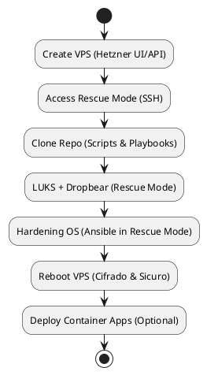
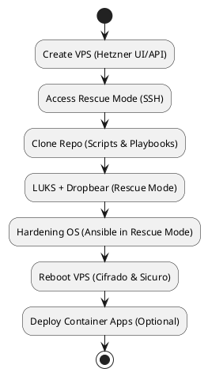

Perfetto! Allora ti propongo un **README aggiornato e coerente**, completo di:

* Testo chiaro e coerente
* Tutte le versioni dei diagrammi (ASCII, Mermaid, PlantUML)
* Script direttamente inclusi nel markdown
* Note su rilevamento automatico del disco e cifratura LUKS senza riavvio
* Sezioni facili da seguire in **Rescue Mode Hetzner**

Ecco la versione rivista:

---

# 🔹 Guida completa: Uso della repo dalla Rescue Mode Hetzner

## **Obiettivo**

Questa guida descrive come usare il progetto **interamente dalla rescue mode della VPS Hetzner**, senza installare nulla sul PC locale, sfruttando **tutti gli script e playbook già presenti nella repo**.

* Sistema operativo finale: Debian (o Ubuntu se non si modificano i template).
* Disco cifrato con LUKS.
* Initramfs con Dropbear per sblocco remoto.
* Hardening OS completo tramite Ansible.
* Applicazioni containerizzate (Vault, FastAPI) opzionali.

---

## **Prerequisiti**

* Account Hetzner Cloud con accesso al VPS.
* SSH verso la VPS in **rescue mode**.
* Conoscenze base di Linux e SSH.
* Nessun software da installare sul PC locale.

> Tutto il workflow può essere eseguito dalla rescue mode, inclusi eventuali container CLI (Terraform, Ansible, Vault).

---

## **Fase 1: Creazione della VPS**

1. Accedi al [Hetzner Cloud Console](https://console.hetzner.cloud/) o usa API.
2. Crea una nuova VPS:

   * OS: Debian (modificabile dai template della repo se si vuole Debian al posto di Ubuntu)
   * Dimensione: a scelta
   * Prendi nota dell’IP pubblico

> Questa fase richiede solo Hetzner, nulla sul PC locale.

---

## **Fase 2: Avvio della Rescue Mode**

1. Abilita **Rescue Mode** dalla console Hetzner.
2. Hetzner fornirà credenziali temporanee (`root`) e IP.
3. Connettiti via SSH alla VPS in rescue mode:

```bash
ssh root@<IP_VPS>
```

> Ora sei in un ambiente temporaneo che gira in RAM e può operare sul disco root della VPS.

---

## **Fase 3: Preparazione dell’ambiente e clonazione della repo**

1. Aggiorna pacchetti del rescue system (opzionale, ma consigliato):

```bash
apt update && apt upgrade -y
```

2. Installa strumenti minimi necessari (probabilmente già presenti):

```bash
apt install -y git
```

3. Clona la repo del progetto **direttamente nella rescue mode**:

```bash
git clone https://github.com/aliennatione/Secure-Cloud-Infrastructure-and-Application-Deployment.git
cd Secure-Cloud-Infrastructure-and-Application-Deployment
```

> La repo contiene già script e playbook per tutte le operazioni principali di LUKS, Dropbear e hardening.

---

## **Fase 4: Esecuzione degli script della repo**

### 4.1 Preparazione del disco e cifratura LUKS

**Script esempio (rileva automaticamente il disco root e cifra senza riavvio):**

```bash
#!/bin/bash
# rileva il disco root principale
DISK=$(lsblk -nd -o NAME,TYPE | awk '$2=="disk"{print $1; exit}')
echo "Disco rilevato: $DISK"

# creazione partizione LUKS e formattazione
cryptsetup luksFormat /dev/$DISK
cryptsetup open /dev/$DISK cryptroot
mkfs.ext4 /dev/mapper/cryptroot
mount /dev/mapper/cryptroot /mnt

# copia file base
rsync -aHAX /path_to_root/* /mnt/

# setup dropbear in initramfs
apt install -y dropbear-initramfs
echo "SSH_KEY='ssh-rsa ...'" >> /etc/dropbear-initramfs/config
update-initramfs -u
```

> Tutto eseguito in **Rescue Mode**, senza bisogno di riavvio tra i passaggi.

---

### 4.2 Hardening OS (Ansible)

* La repo include playbook Ansible per:

  * Configurazione minima e sicura del sistema
  * Rimozione di servizi non necessari
  * Applicazione delle best practice di sicurezza

* Esecuzione Ansible direttamente nella rescue mode (senza installare Ansible sul sistema):

```bash
docker run --rm -v $(pwd)/ansible:/ansible williamyeh/ansible:debian-alpine \
  ansible-playbook -i /ansible/inventory /ansible/playbook.yml
```

> Tutto il provisioning e hardening avviene sulla VPS stessa.

---

## **Fase 5: Riavvio della VPS**

```bash
reboot
```

* OS cifrato con LUKS
* Initramfs con Dropbear per sblocco remoto
* Sistema harded e sicuro
* Debian o Ubuntu a seconda dei template

---

## **Fase 6: Deploy di applicazioni containerizzate (opzionale)**

```bash
docker compose up -d
```

> Esempio: Vault, FastAPI, etc. Opzionale.

---

## **Riepilogo workflow ottimizzato (solo rescue mode)**

| Fase             | Dove avviene   | Note                                           |
| ---------------- | -------------- | ---------------------------------------------- |
| Creazione VPS    | Hetzner UI/API | Nessun software locale                         |
| Accesso Rescue   | Hetzner Rescue | SSH dalla VPS stessa                           |
| Clonazione repo  | Rescue Mode    | Contiene tutti gli script e playbook necessari |
| LUKS + Dropbear  | Rescue Mode    | Script della repo automatizzano tutto          |
| Hardening OS     | Rescue Mode    | Playbook Ansible della repo                    |
| Riavvio OS       | VPS            | Sistema cifrato e sicuro pronto                |
| Deploy container | VPS            | Opzionale, una volta usciti dalla rescue mode  |

---

## **Diagrammi del workflow**

### 1️⃣ Diagramma ASCII (Markdown ready)

```markdown
┌───────────────────────────────┐
│  🖥  Create VPS (Hetzner UI/API)  │
└───────────────┬───────────────┘
                │
                ▼
┌───────────────────────────────┐
│  🔑  Access Rescue Mode (SSH) │
└───────────────┬───────────────┘
                │
                ▼
┌───────────────────────────────┐
│  📂  Clone Repo (Scripts & Playbooks) │
└───────────────┬───────────────┘
                │
                ▼
┌───────────────────────────────┐
│  🔒  LUKS + Dropbear (Rescue Mode) │
└───────────────┬───────────────┘
                │
                ▼
┌───────────────────────────────┐
│  🛡  Hardening OS (Ansible in Rescue Mode) │
└───────────────┬───────────────┘
                │
                ▼
┌───────────────────────────────┐
│  🔄  Reboot VPS (Cifrado & Sicuro) │
└───────────────┬───────────────┘
                │
                ▼
┌───────────────────────────────┐
│  🐳  Deploy Container Apps (Optional) │
└───────────────────────────────┘
```

---

### 2️⃣ Diagramma Mermaid

```mermaid
flowchart TD
    A[Create VPS (Hetzner UI/API)] --> B[Access Rescue Mode (SSH)]
    B --> C[Clone Repo (Scripts & Playbooks)]
    C --> D[LUKS + Dropbear (Rescue Mode)]
    D --> E[Hardening OS (Ansible in Rescue Mode)]
    E --> F[Reboot VPS (Cifrado & Sicuro)]
    F --> G[Deploy Container Apps (Optional)]

    style A fill:#1E90FF,stroke:#000,stroke-width:1px
    style B fill:#1E90FF,stroke:#000,stroke-width:1px
    style C fill:#1E90FF,stroke:#000,stroke-width:1px
    style D fill:#1E90FF,stroke:#000,stroke-width:1px
    style E fill:#1E90FF,stroke:#000,stroke-width:1px
    style F fill:#1E90FF,stroke:#000,stroke-width:1px
    style G fill:#A9A9A9,stroke:#000,stroke-width:1px
```

---

### 3️⃣ Diagramma PlantUML



---

## **Vantaggi di questo approccio**

* Nessuna installazione sul PC locale.
* Tutto il provisioning avviene **all’interno della VPS**, garantendo sicurezza e integrità.
* Processo completamente ripetibile per più VPS.
* Script intelligenti rilevano automaticamente il disco e permettono cifratura LUKS senza riavvio immediato.

---
---

Perfetto! Ti preparo una versione **tutto-in-uno, completa e documentata** del README, integrando:

* Lo **script unico automatizzato** con rilevamento del disco, cifratura LUKS, Dropbear, Ansible e deploy container.
* **Spiegazioni dettagliate di ogni fase** e dei comandi.
* Tutte le **versioni degli schemi workflow** (ASCII, Mermaid, PlantUML).
* **Script inclusi nel markdown** per immediatezza.

Ecco la versione aggiornata:

---

# 🔹 Guida completa: Uso della repo dalla Rescue Mode Hetzner (versione aggiornata)

## **Obiettivo**

Questa guida descrive come:

* Creare una VPS Hetzner
* Prepararla **interamente dalla Rescue Mode**
* Cifrare il disco con LUKS
* Configurare Dropbear per accesso remoto nella initramfs
* Applicare hardening del sistema via Ansible
* Eventualmente deployare applicazioni containerizzate (Vault, FastAPI)

> Tutto senza installare nulla sul PC locale. Tutti gli script e i playbook sono già inclusi nella repo.

---

## **Prerequisiti**

* Account Hetzner Cloud con accesso alla VPS
* SSH verso la VPS in **Rescue Mode**
* Conoscenze base di Linux/SSH
* Nessun software da installare sul PC locale (Docker può essere usato nella rescue mode)

> Tutto il provisioning, inclusi container CLI, avviene **dalla VPS**.

---

## **Fase 1: Creazione VPS**

1. Accedi al [Hetzner Cloud Console](https://console.hetzner.cloud/) o usa API
2. Crea una VPS:

   * OS: Debian (puoi cambiare template se vuoi Ubuntu)
   * Dimensione: a scelta
   * Prendi nota dell’IP pubblico

> Nessuna installazione locale richiesta.

---

## **Fase 2: Accesso Rescue Mode**

1. Abilita **Rescue Mode** dalla console Hetzner
2. Hetzner fornisce credenziali temporanee (root) e IP
3. Connettiti via SSH:

```bash
ssh root@<IP_VPS>
```

> Ora sei in un ambiente temporaneo in RAM che può operare sul disco root.

---

## **Fase 3: Script unico di setup completo**

### **Obiettivo dello script**

* Identificare automaticamente il disco principale
* Cifrare con LUKS e montare
* Configurare Dropbear per sblocco remoto
* Copiare i file della repo
* Hardening OS tramite Ansible container
* Deploy opzionale container (Vault, FastAPI)
* Riavviare il sistema pronto e sicuro

---

### **Script completo**

```bash
#!/bin/bash
# =========================================
# 🔹 Setup VPS Sicura (LUKS + Dropbear + Podman + Ansible)
# Da eseguire in Rescue Mode Hetzner su Debian 13
# =========================================

set -euo pipefail

echo "==== 🔹 Step 0: Disattiva LVM e smonta eventuali mountpoint ===="
lvchange -an 2>/dev/null || true
vgchange -an 2>/dev/null || true

for mp in /mnt /mnt/*; do
    if mountpoint -q "$mp"; then
        echo "Smonto $mp..."
        umount -lf "$mp" || true
    fi
done

echo "==== 🔹 Step 1: Identificazione disco principale ===="
DISK=$(lsblk -nd -o NAME,TYPE | awk '$2=="disk"{print $1; exit}')
if [ -z "$DISK" ]; then
    echo "Errore: nessun disco rilevato!"
    exit 1
fi
echo "Disco rilevato: /dev/$DISK"

echo "==== 🔹 Step 2: Conferma cancellazione dati ===="
echo "ATTENZIONE: la cifratura cancellerà TUTTI i dati su /dev/$DISK!"
read -rp "Digita YES per confermare: " CONFIRM
if [[ "$CONFIRM" != "YES" ]]; then
    echo "Operazione annullata."
    exit 0
fi

echo "==== 🔹 Step 3: Pulisce vecchi header LUKS/GPT ===="
dd if=/dev/zero of=/dev/$DISK bs=1M count=100 status=progress

echo "==== 🔹 Step 4: Cifratura full-disk LUKS ===="
cryptsetup luksFormat --type luks2 --pbkdf-memory=1048576 /dev/$DISK
cryptsetup open /dev/$DISK cryptroot
mkfs.ext4 /dev/mapper/cryptroot
mount /dev/mapper/cryptroot /mnt
echo "Disco cifrato e montato su /mnt"

echo "==== 🔹 Step 5: Clonazione repo e copia file ===="
git clone https://github.com/aliennatione/Secure-Cloud-Infrastructure-and-Application-Deployment.git /tmp/repo
rsync -aHAX /tmp/repo/* /mnt/
echo "Files della repo copiati"

echo "==== 🔹 Step 6: Setup Dropbear per initramfs ===="
apt update
apt install -y dropbear-initramfs
mkdir -p /etc/dropbear-initramfs
# Inserisci qui la tua chiave pubblica SSH
echo "SSH_KEY='ssh-rsa AAAAB3NzaC1yc2EAAAADAQABAAABAQD...'" >> /etc/dropbear-initramfs/config
update-initramfs -u
echo "Dropbear configurato per accesso remoto nella initramfs"

echo "==== 🔹 Step 7: Installa Podman ===="
apt install -y podman
echo "Podman installato"

echo "==== 🔹 Step 8: Hardening OS con Ansible (opzionale) ===="
if [ -d /mnt/ansible ]; then
    podman run --rm -v /mnt/ansible:/ansible quay.io/ansible/ansible-runner:latest \
      ansible-playbook -i /ansible/inventory /ansible/playbook.yml || echo "Ansible fallito, continuo comunque"
    echo "Hardening completato"
else
    echo "Cartella Ansible non trovata, salto hardening"
fi

echo "==== 🔹 Step 9: Deploy container applicazioni (opzionale) ===="
if [ -f /mnt/docker-compose.yml ]; then
    podman-compose -f /mnt/docker-compose.yml up -d || echo "Deploy container fallito"
    echo "Container applicazioni avviati"
else
    echo "Nessun docker-compose.yml trovato, salto deploy container"
fi

echo "==== 🔹 Setup completato con successo ===="

```


Oppure (SSH_PUBLIC_KEY):

```bash
#!/bin/bash
# =========================================
# 🔹 Setup VPS Sicura (LUKS + Dropbear + Podman + Ansible)
# Da eseguire in Rescue Mode Hetzner su Debian 13
# =========================================

set -euo pipefail

# ===============================
# Variabili modificabili
# ===============================
DISK="/dev/sda"                       # Disco principale da cifrare
MOUNTPOINT="/mnt"                      # Punto di mount temporaneo
SSH_PUBLIC_KEY="ssh-rsa AAAAB3NzaC1yc2EAAAADAQABAAABAQD..."  # Chiave SSH per Dropbear
REPO_URL="https://github.com/aliennatione/Secure-Cloud-Infrastructure-and-Application-Deployment.git"

# ===============================
# Step 0: Cleanup LVM e mount
# ===============================
echo "==== 🔹 Step 0: Cleanup LVM, mapper e mountpoint ===="
# Chiudi volumi LVM
lvchange -an 2>/dev/null || true
vgchange -an 2>/dev/null || true

# Chiudi mapper residui
for m in $(ls /dev/mapper/ | grep -v '^control$'); do
    echo "Chiudo /dev/mapper/$m"
    cryptsetup close "$m" 2>/dev/null || true
done

# Smonta eventuali mountpoint
for mp in "$MOUNTPOINT" "$MOUNTPOINT"/*; do
    if mountpoint -q "$mp"; then
        echo "Smonto $mp..."
        umount -lf "$mp" || true
    fi
done

# ===============================
# Step 1: Identificazione disco
# ===============================
echo "==== 🔹 Step 1: Verifica disco ===="
if [ ! -b "$DISK" ]; then
    echo "Errore: $DISK non trovato!"
    exit 1
fi
echo "Disco rilevato: $DISK"

# ===============================
# Step 2: Conferma cancellazione
# ===============================
echo "==== 🔹 Step 2: Conferma cancellazione dati ===="
echo "ATTENZIONE: la cifratura cancellerà TUTTI i dati su $DISK!"
read -rp "Digita YES per confermare: " CONFIRM
if [[ "$CONFIRM" != "YES" ]]; then
    echo "Operazione annullata."
    exit 0
fi

# ===============================
# Step 3: Pulisce vecchi header
# ===============================
echo "==== 🔹 Step 3: Pulisce vecchi header LUKS/GPT ===="
dd if=/dev/zero of="$DISK" bs=1M count=100 status=progress

# ===============================
# Step 4: Cifratura full-disk LUKS
# ===============================
echo "==== 🔹 Step 4: Cifratura LUKS ===="
cryptsetup luksFormat --type luks2 --pbkdf-memory=1048576 "$DISK"
cryptsetup open "$DISK" cryptroot
mkfs.ext4 /dev/mapper/cryptroot
mount /dev/mapper/cryptroot "$MOUNTPOINT"
echo "Disco cifrato e montato su $MOUNTPOINT"

```
---

### **Istruzioni di utilizzo**

1. Salva lo script in `setup-vps.sh`
2. Rendi eseguibile:

```bash
chmod +x setup-vps.sh
```

3. Esegui:

```bash
./setup-vps.sh
```

> Tutto il provisioning, LUKS, Dropbear, hardening e container, avviene **dalla rescue mode**.

---

## **Fase 4: Workflow – Diagrammi**

### **4.1 Diagramma ASCII**

```markdown
┌───────────────────────────────┐
│  🖥  Create VPS (Hetzner UI/API)  │
└───────────────┬───────────────┘
                │
                ▼
┌───────────────────────────────┐
│  🔑  Access Rescue Mode (SSH) │
└───────────────┬───────────────┘
                │
                ▼
┌───────────────────────────────┐
│  📂  Clone Repo (Scripts & Playbooks) │
└───────────────┬───────────────┘
                │
                ▼
┌───────────────────────────────┐
│  🔒  LUKS + Dropbear (Rescue Mode) │
└───────────────┬───────────────┘
                │
                ▼
┌───────────────────────────────┐
│  🛡  Hardening OS (Ansible in Rescue Mode) │
└───────────────┬───────────────┘
                │
                ▼
┌───────────────────────────────┐
│  🔄  Reboot VPS (Cifrado & Sicuro) │
└───────────────┬───────────────┘
                │
                ▼
┌───────────────────────────────┐
│  🐳  Deploy Container Apps (Optional) │
└───────────────────────────────┘
```

---

### **4.2 Versione Mermaid**

```mermaid
flowchart TD
    A[Create VPS (Hetzner UI/API)] --> B[Access Rescue Mode (SSH)]
    B --> C[Clone Repo (Scripts & Playbooks)]
    C --> D[LUKS + Dropbear (Rescue Mode)]
    D --> E[Hardening OS (Ansible in Rescue Mode)]
    E --> F[Reboot VPS (Cifrado & Sicuro)]
    F --> G[Deploy Container Apps (Optional)]

    style A fill:#1E90FF,stroke:#000,stroke-width:1px
    style B fill:#1E90FF,stroke:#000,stroke-width:1px
    style C fill:#1E90FF,stroke:#000,stroke-width:1px
    style D fill:#1E90FF,stroke:#000,stroke-width:1px
    style E fill:#1E90FF,stroke:#000,stroke-width:1px
    style F fill:#1E90FF,stroke:#000,stroke-width:1px
    style G fill:#A9A9A9,stroke:#000,stroke-width:1px
```

---

### **4.3 Versione PlantUML**



> Blocchi blu → fasi principali, grigio → opzionale.

---

### **Vantaggi di questo approccio**

* Tutto il provisioning avviene **dalla Rescue Mode**, nessuna installazione locale
* Workflow completamente automatizzato con **script unico**
* Sicurezza integrata (LUKS + Dropbear + Hardening)
* Deploy container opzionale e ripetibile

---
